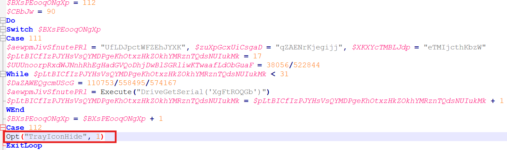
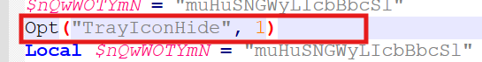

# AutoItSwitchCleaner
A handy tool I wrote to eliminate an obfuscation pattern I encounter very much in malware samples utilizing AutoIt scripts to prepare the next stage.

###### The obfuscation pattern: initializes some variables and then uses a switch statement on one of them but only one case is valid and the loop exits afterwards rendering the other cases useless.

###### The code proportion added with this obfuscation technique is huge. Which makes this tool very usefull to eliminate a boring work.

#### Real world example: Malware sample : sha256:c3c1549bdd5613e9dbc3f09963cd1bd0f303b6f33bb4df62d9260590869cadec
###### In this case, the tool managed to reduce the code by 90% eliminating useless lines

##### The pattern goes like this:

##### In the end we only have the useful part

